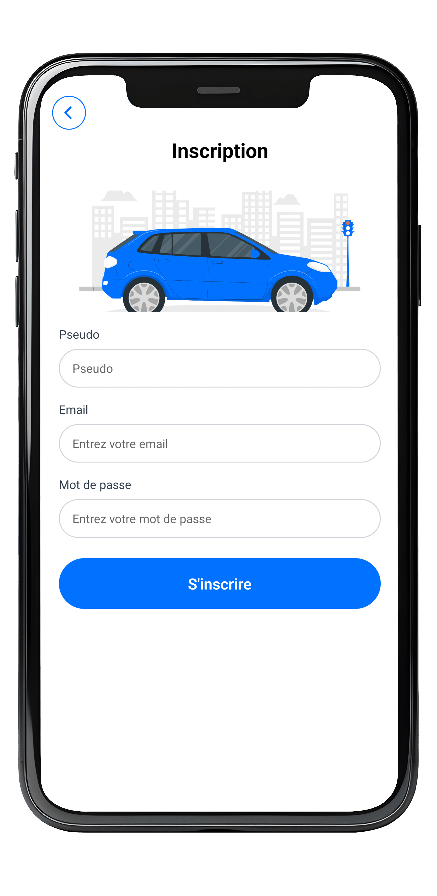
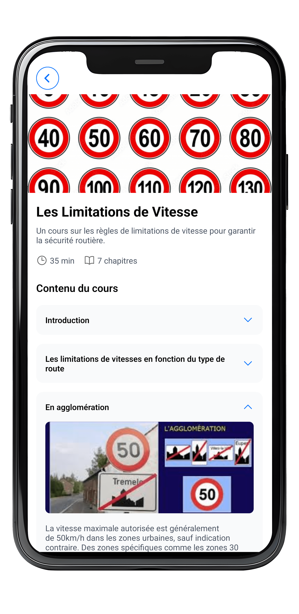
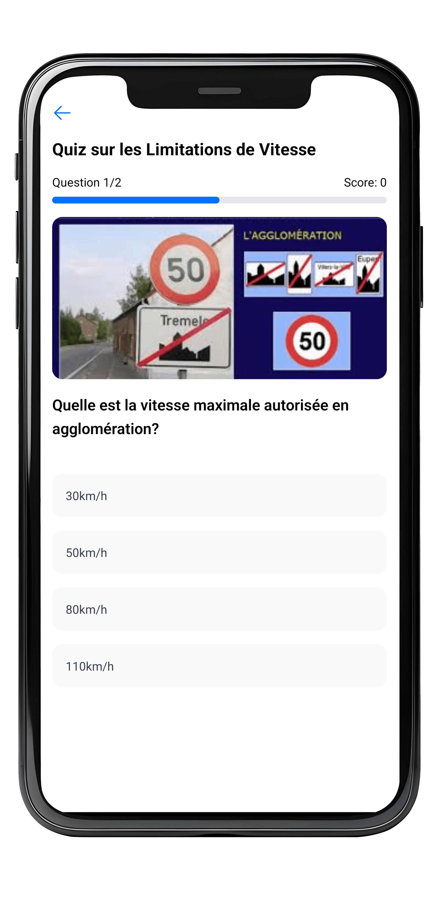
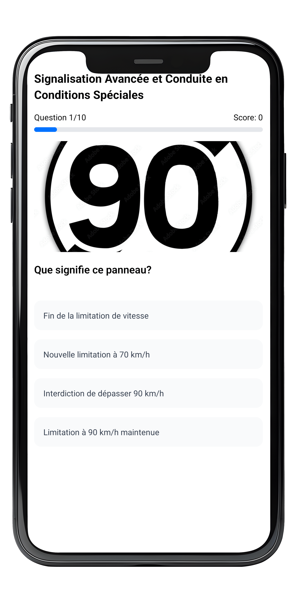
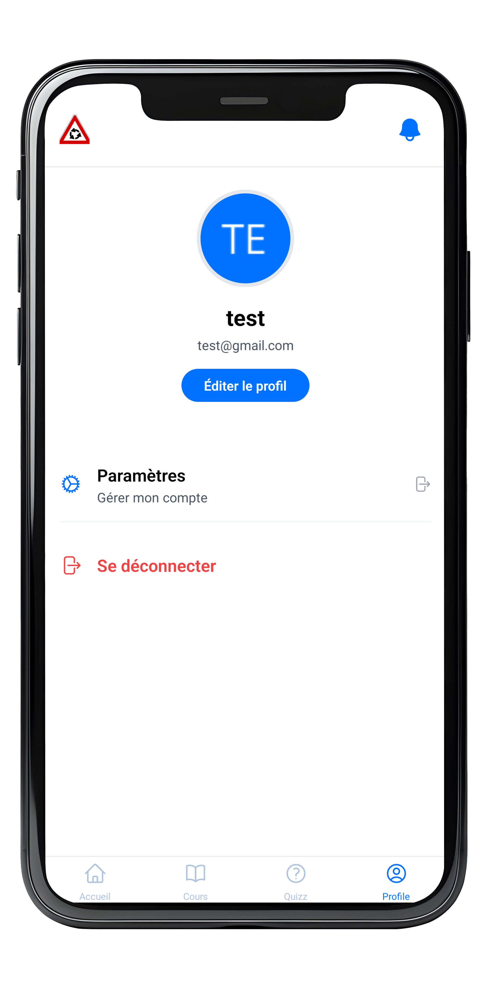

# React Native Driving School App

This is a React Native Driving School app for learning traffic rules with interactive courses and quizzes for the built as part of the "<JeemaCoder />" Hackathon by Bakeli.

### Stack:

- [Expo Router](https://docs.expo.dev/routing/introduction/) for file-based navigation and API Routes
- [Native Wind](https://nativewind.dev/docs/installation) for styling with Tailwind adapted for React Native
- [Expo AV](https://docs.expo.dev/versions/latest/sdk/av/) for quiz sound effects
- API Express.js: [link-to-express-api-repo](https://github.com/boysimon10/autoecole-api)
- MongoDB for database management

### Screenshots

